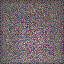
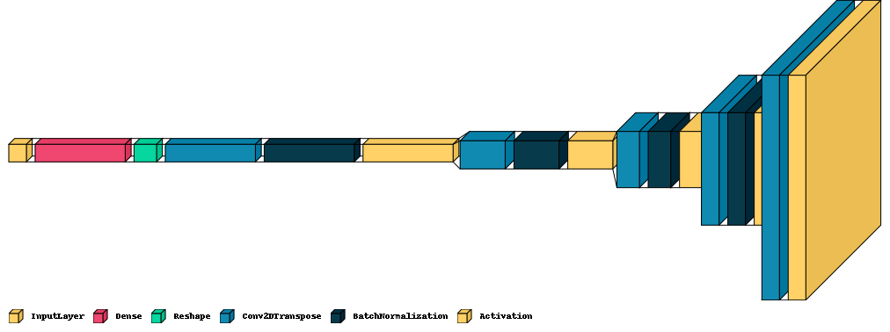
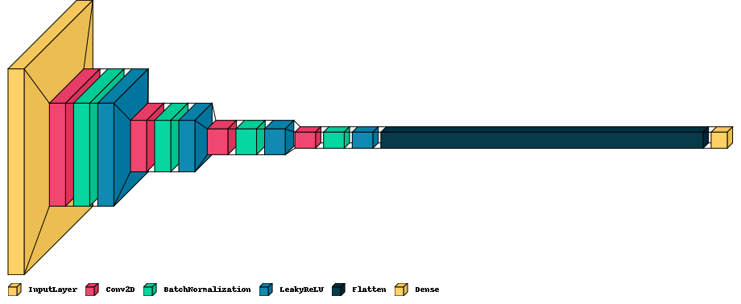

# Simple DCGAN

Deep convolutional generative adversarial network implemented in a python class for generating anime character faces. 

#### Hyper parameters:

  * Image input shape - [64,64,3] 
  * latent dims for generator = 128 
  * optimizer: Adam, learning rate = 0.00002, beta1=0.5
  * batch_size: 200
  * number training steps of the discriminator per training step of the generator : 6
### Generator architecture: 

 

### Discriminator architecture: 

 
